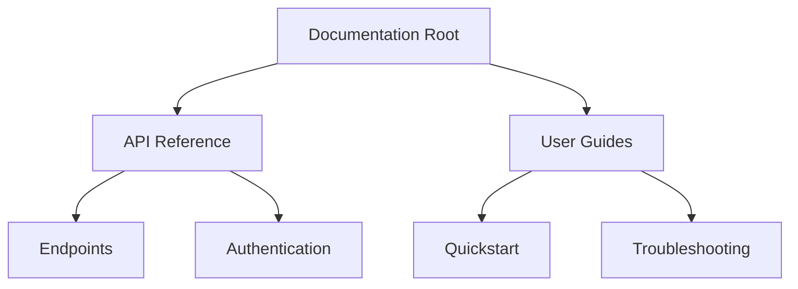

## Overview

Dafiniti-Javeed provides powerful tools to manage your documentation projects effectively. You can structure content hierarchically, collaborate with teams, track changes through version history, and find information quickly with search and tags. These features help you maintain organized, up-to-date docs.

<Columns cols={2}>
  <Card title="Structuring" icon="layout" href="#document-structuring">
    Organize docs into pages, sections, and hierarchies.
  </Card>
  <Card title="Collaboration" icon="users" href="#collaboration">
    Share and work together in real-time.
  </Card>
  <Card title="Version History" icon="git-branch" href="#version-history">
    Track edits and revert changes easily.
  </Card>
  <Card title="Search & Tagging" icon="search" href="#search-tagging">
    Find content fast with advanced search.
  </Card>
</Columns>

## Document Structuring and Hierarchies

Create nested page structures to reflect your project's organization. Use folders for top-level categories and pages for detailed content. This hierarchy improves navigation and discoverability.



<Callout kind="tip">
  Start with a clear outline. Use the dashboard at `https://app.dafiniti-javeed.com/docs` to drag and drop pages into folders.
</Callout>

## Collaboration and Sharing Options

Invite team members to edit docs simultaneously. Share links with permissions: view-only, edit, or admin.

<Tabs>
  <Tab title="Public Sharing" icon="globe">
    Generate a public link for read access.
    
    ```
    https://app.dafiniti-javeed.com/docs/project-name/public
    ```
    
    Set expiration dates for temporary shares.
  </Tab>
  <Tab title="Team Invite" icon="users">
    Add users by email.
    
````markdown
```javascript
// Example invite API call
const response = await fetch('https://api.dafiniti-javeed.com/invites', {
  method: 'POST',
  headers: { 'Authorization': `Bearer ${YOUR_API_KEY}` },
  body: JSON.stringify({ email: 'team@company.com', role: 'editor' })
});
````
  </Tab>
  <Tab title="Embed" icon="code">
    Embed docs in your site.
    
    ```
    <iframe src="https://app.dafiniti-javeed.com/embed/project/abc123" />
    ```
  </Tab>
</Tabs>

## Version History and Editing Tools

Every edit creates a version. View diffs, restore previous versions, or compare changes.

<Steps>
  <Step title="View History" icon="clock">
    Click the history icon on any page.
  </Step>
  <Step title="Restore Version" icon="refresh-cw">
    Select a version and click restore.
  </Step>
  <Step title="Compare Changes" icon="git-compare">
    Use the diff viewer to see additions and deletions.
  </Step>
</Steps>

<Expandable title="Advanced Editing Features" default-open="false">
  Rich text editor supports markdown, tables, and embeds. Keyboard shortcuts like `Ctrl`<kbd>+</kbd>`<kbd>B</kbd> for bold speed up editing.
</Expandable>

## Search Functionality and Tagging

Search across all docs with full-text indexing. Add tags for categorization.

<CodeGroup tabs="Add Tag,Search by Tag">
````javascript
// Add tag to a page
await fetch(`https://api.dafiniti-javeed.com/pages/${PAGE_ID}/tags`, {
  method: 'POST',
  headers: { 'Authorization': `Bearer ${YOUR_API_KEY}` },
  body: JSON.stringify({ tags: ['api', 'v1'] })
});
````
````javascript
// Search by tag
const results = await fetch('https://api.dafiniti-javeed.com/search?tags=api');
console.log(results);
````
</CodeGroup>

<Callout kind="info">
  Tags support autocomplete. Use them like `{api}`, `{feature}` for quick filtering.
</Callout>

Organize your documentation workflow with these core features to boost productivity and team collaboration.